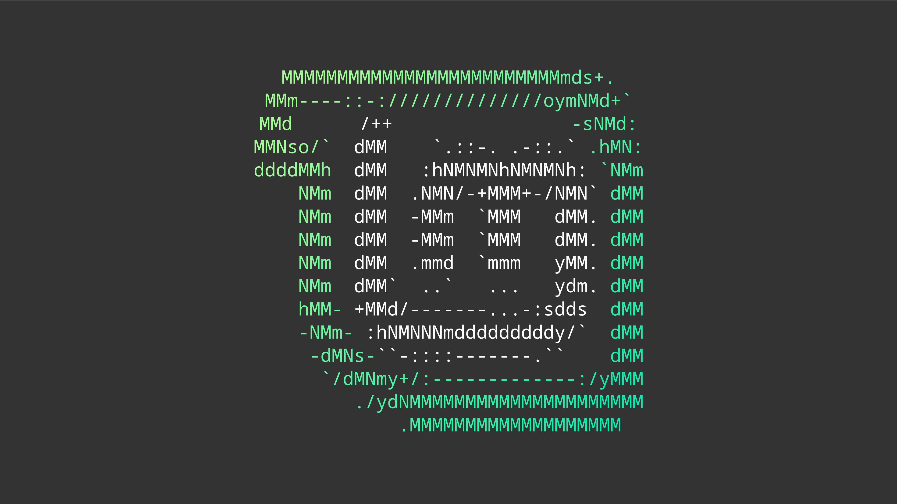

# Debian

## [Mint1.png](https://github.com/deeadly137/wallpapers/blob/main/wallpapers/distro/debian/Mint1.png)

## [debian.png](https://github.com/deeadly137/wallpapers/blob/main/wallpapers/distro/debian/debian.png)

## [ubuntu-magenta-pink.png](https://github.com/deeadly137/wallpapers/blob/main/wallpapers/distro/debian/ubuntu-magenta-pink.png)

## [ubuntu-magenta-blue.png](https://github.com/deeadly137/wallpapers/blob/main/wallpapers/distro/debian/ubuntu-magenta-blue.png)

## [ubuntu-black-4k.png](https://github.com/deeadly137/wallpapers/blob/main/wallpapers/distro/debian/ubuntu-black-4k.png)

