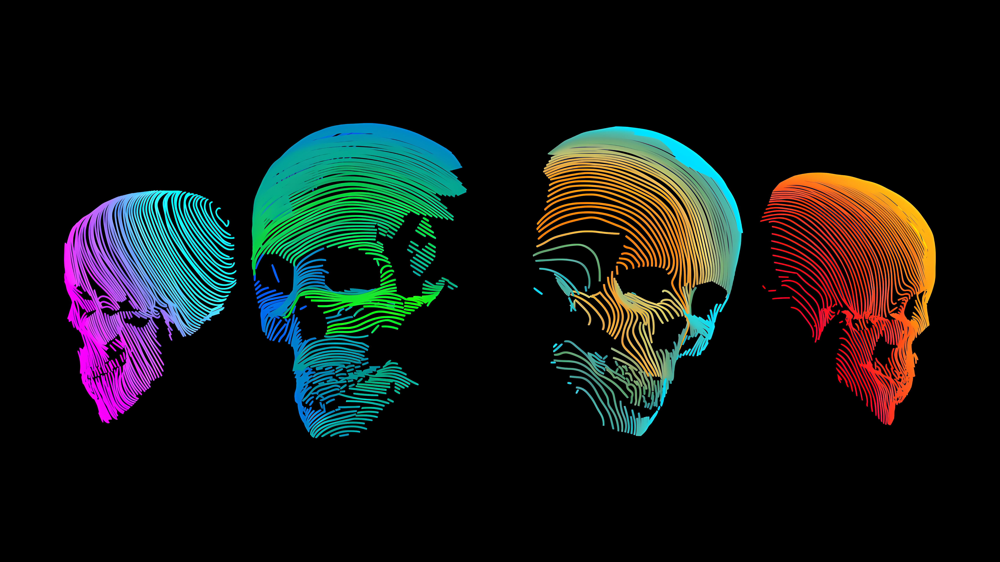

# Minimal

## [3squares.png](https://github.com/deeadly137/wallpapers/blob/main/wallpapers/minimal/3squares.png)

 
## [dark_skulls.png](https://github.com/deeadly137/wallpapers/blob/main/wallpapers/minimal/dark_skulls.png)
